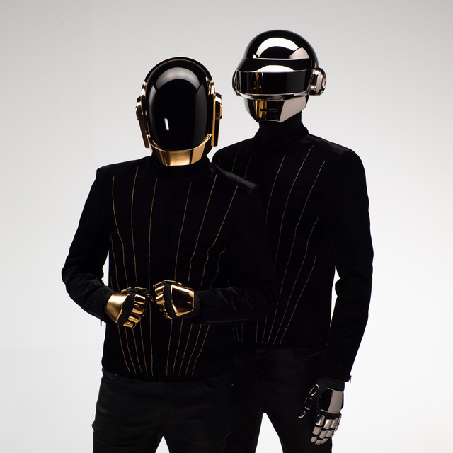

---
# Feel free to add content and custom Front Matter to this file.
# To modify the layout, see https://jekyllrb.com/docs/themes/#overriding-theme-defaults

---
layout: home
layout: home title: “Bienvenidos al blog de Daft Punk”
---

# 🎵 Bienvenidos al Blog de Daft Punk

¡Hola! Este es un blog dedicado a **Daft Punk**, el icónico dúo francés de música electrónica. Aquí encontrarás noticias, curiosidades, análisis de álbumes y más sobre **Thomas Bangalter y Guy-Manuel de Homem-Christo**.

---

## Sobre Daft Punk

Daft Punk es conocido por su estilo único, que mezcla *house*, *funk*, *disco* y música electrónica. Su característico uso de cascos robóticos ha marcado un antes y un después en la cultura pop.

---

## Secciones del blog

- **Álbumes**: Revisiones de discos como *Homework*, *Discovery* y *Random Access Memories*.
- **Conciertos y eventos**: Crónicas de actuaciones en vivo y festivales.
- **Curiosidades**: Datos interesantes sobre su trayectoria, videos y colaboraciones.
- **Multimedia**: Videos, imágenes y remixes de sus canciones más icónicas.

---

## Publicaciones recientes

1. [Random Access Memories]({{ post_url 2025-11-20-random-access-memories }})
2. [La historia de los cascos]({{ post_url 2025-12-2-historia-de-los-cascos }})
3. [Discovery — Análisis del álbum]({{ post_url 2025-12-2-discovery-analisis }})

---
